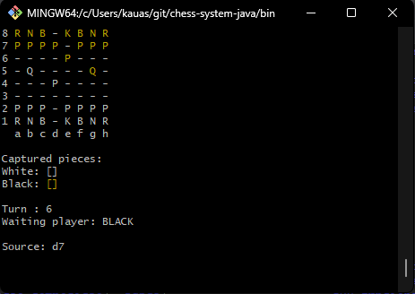
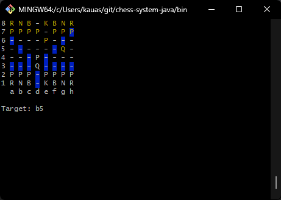

# Chess System Java

A simple chess game that can be played through a terminal.

## How to Play

1. Clone the repository:
   
   ```bash
   git clone git@github.com:kauassilva/chess-system-java.git
   ```
   
2. Access the folder `chess-system-java\bin`:
   
   ```bash
   cd chess-system-java/bin/
   ```
   
3. Run the Java:
   
   ```bash
   java application/Program
   ```

4. The white pieces start first, select a piece by its coordinate, indicating first the letter and then the number (a2, f3, ...):

    
   
5. Select an available position (blue color) by its coordinate:

    
   
6. Have fun.
